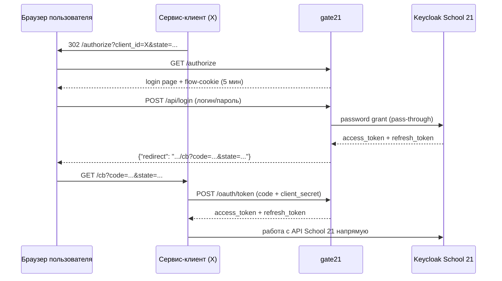
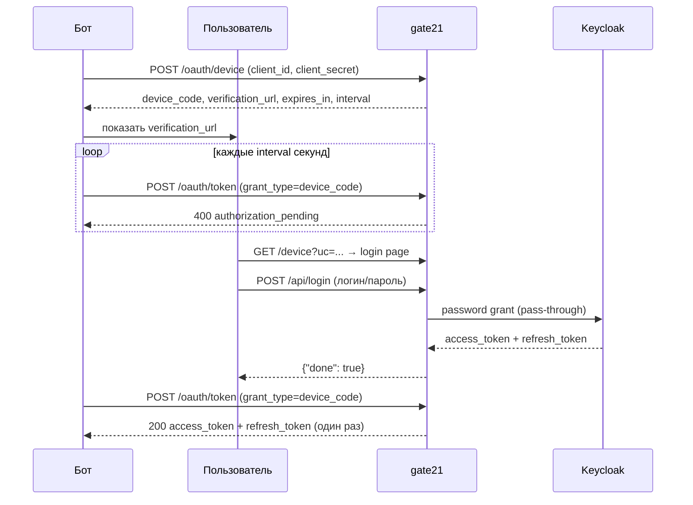

# Интеграция с gate21 — гайд для клиентских сервисов

gate21 — брокер аутентификации: принимает логин/пароль пользователя, получает
токены School 21 через Keycloak и передаёт их сервису-клиенту. Пароли не
проходят через код сервиса; сервис сразу получает токены.

В примерах ниже `https://<AUTH_BASE>` — адрес развёрнутого gate21
(подставляется при деплое, оф. публичный адрес gate21.dnkrsk.ru).

## Обзор потока



## 1. Регистрация клиента

Администратор gate21 регистрирует сервис с набором параметров:

| Параметр | Где хранится | Назначение |
|---|---|---|
| `client_id` | конфигурация сервиса | идентификатор сервиса |
| `redirect_uri` | реестр на стороне gate21 | точный URL приёма callback (только web-клиенты) |
| `client_secret` | **только** в бэкенде сервиса, в секретах | подпись при обмене `code` и в device-flow |

`redirect_uri` проверяется по полному совпадению: изменение пути, query,
регистра или добавление `/` в конце — отказ. Любые изменения — через
администратора. Клиенты device-flow (`"flow": "device"`) `redirect_uri`
не имеют — см. раздел 7.

## 2. Старт авторизации (редирект пользователя)

С бэкенда или фронта сервиса пользователь направляется на gate21 (302):

```
302 https://<AUTH_BASE>/authorize?client_id=YOUR_CLIENT_ID&state=YOUR_STATE
```

| Параметр | Обязателен | Описание |
|---|---|---|
| `client_id` | да | идентификатор сервиса |
| `state` | настоятельно рекомендуется | случайная непредсказуемая строка |

`state` генерируется на бэкенде: ≥128 бит из CSPRNG, хранится в сессии
пользователя с коротким TTL и сверяется при возврате — защита от подмены
callback (CSRF). gate21 лишь прокидывает `state` обратно.

Ответ при неизвестном `client_id`: `400 Bad Request` (текст).

## 3. Callback на сервисе

После логина браузер приходит на `redirect_uri`:

```
GET /cb?code=ONE_TIME_CODE&state=YOUR_STATE
```

1. `state` сверяется с сохранённым; при несовпадении запрос отклоняется.
2. `code` обменивается немедленно, в пределах **120 секунд** (шаг 4).
3. `code` одноразовый: повторный запрос возвращает ошибку.

## 4. Обмен code на токены (server-to-server)

`code` передаётся через браузер, поэтому обмен выполняет только бэкенд
сервиса — `client_secret` не должен попадать в SPA/мобильное приложение.

```bash
curl -X POST "https://<AUTH_BASE>/oauth/token" \
  -H "Content-Type: application/x-www-form-urlencoded" \
  -d "client_id=YOUR_CLIENT_ID" \
  -d "client_secret=YOUR_SECRET" \
  -d "code=ONE_TIME_CODE"
```

Ответ (`200 OK`):

```json
{
  "access_token": "eyJhbGciOiJSUzI1NiIs...",
  "refresh_token": "eyJhbGciOiJIUzI1NiIs...",
  "token_type": "bearer",
  "expires_in": 300,
  "scope": "openid"
}
```

Токены — **оригинальные JWT Keycloak**, без переупаковки; используются
напрямую против API School 21.

### Ошибки `/oauth/token`

| Статус | `error` | Причина | Действие |
|---|---|---|---|
| `400` | `invalid_request` | отсутствует `code`/`client_id`/`client_secret` | проверка формы запроса |
| `400` | `invalid_grant` | `code` истёк (120 с), использован или битый | перезапуск авторизации (шаг 2) |
| `401` | `invalid_client` | неверный `client_secret` | проверка конфигурации; `code` при этой ошибке **не сгорает** |
| `429` | — | превышен rate limit | повтор с backoff |
| `502` | — | upstream-сервис недоступен | повтор позже |

## 5. Использование токена

```bash
curl -H "Authorization: Bearer $ACCESS_TOKEN" "https://school21-api/…"
```

Валидация `access_token` на стороне сервиса (подпись RS256, состояние
не хранится):

- JWKS: `https://auth.21-school.ru/auth/realms/EduPowerKeycloak/protocol/openid-connect/certs`
- issuer: `https://auth.21-school.ru/auth/realms/EduPowerKeycloak`

Проверяются `iss`, срок (`exp`), алгоритм (`RS256`) и при наличии `aud`.

## 6. Обновление токена (refresh)

gate21 не хранит токены; refresh выполняется **сервисом напрямую** в Keycloak
(пароль пользователя не требуется):

```bash
curl -X POST "https://auth.21-school.ru/auth/realms/EduPowerKeycloak/protocol/openid-connect/token" \
  -H "Content-Type: application/x-www-form-urlencoded" \
  -d "client_id=school21" \
  -d "grant_type=refresh_token" \
  -d "refresh_token=$REFRESH_TOKEN"
```

При `invalid_grant` (refresh истёк) пользователь повторно направляется на
`/authorize` (шаг 2).

## 7. Вариант без публичного IP: device-flow (для ботов)

Если сервис не принимает HTTP-callback (телеграм-бот за NAT, CLI-утилита),
используется device-flow. Такой клиент регистрируется с `"flow": "device"`
и **без** `redirect_uri`; редиректы не требуются — процессу сервиса нужен
только исходящий HTTPS.



### 7.1. Старт сессии (server-to-server)

```bash
curl -X POST "https://<AUTH_BASE>/oauth/device" \
  -H "Content-Type: application/x-www-form-urlencoded" \
  -d "client_id=YOUR_CLIENT_ID" \
  -d "client_secret=YOUR_SECRET"
```

Ответ (`200 OK`):

```json
{
  "device_code": "…43 символа, секретен…",
  "user_code": "…22 символа…",
  "verification_url": "https://<AUTH_BASE>/device?uc=…",
  "expires_in": 300,
  "interval": 5
}
```

### 7.2. Показ ссылки и поллинг

`verification_url` отображается пользователю (кнопка/ссылка в боте);
параллельно токен-эндпоинт поллится с интервалом не чаще `interval` секунд:

```bash
curl -X POST "https://<AUTH_BASE>/oauth/token" \
  -H "Content-Type: application/x-www-form-urlencoded" \
  -d "grant_type=urn:ietf:params:oauth:grant-type:device_code" \
  -d "device_code=DEVICE_CODE" \
  -d "client_id=YOUR_CLIENT_ID" \
  -d "client_secret=YOUR_SECRET"
```

До входа пользователя ответ — `400 {"error":"authorization_pending"}`;
поллинг продолжается. После успешного логина возвращаются те же токены
Keycloak, что и в code-flow (шаг 4); сессия закрывается — повторный поллинг
даёт `invalid_grant`.

### 7.3. Ошибки `/oauth/token` (device-flow)

| Статус | `error` | Причина | Действие |
|---|---|---|---|
| `400` | `authorization_pending` | пользователь ещё не вошёл | продолжение поллинга через `interval` |
| `400` | `slow_down` | слишком частый поллинг | увеличение интервала, продолжение поллинга |
| `400` | `invalid_grant` | сессия истекла (`AUTH_DEVICE_TTL`, 5 мин), неизвестна или токены уже выданы | перезапуск `/oauth/device` |
| `400` | `invalid_request` | отсутствует `device_code`/`client_id`/`client_secret` | проверка формы запроса |
| `401` | `invalid_client` | неверный `client_secret` | проверка конфигурации |
| `400` | `unsupported_grant_type` | web-клиент (или нестандартный `grant_type`) | для web используется code-flow |
| `500` | `server_error` | у gate21 не задан `AUTH_PUBLIC_BASE` | уведомление администратора |

### 7.4. Безопасность device-flow

- `device_code` — одноразовый, достаточен для получения токенов: не логируется
  и не передаётся по незащищённым каналам (все запросы — только HTTPS);
- `client_secret` обязателен и на старте, и при поллинге (constant-time сверка);
- токены привязаны к `client_id` сессии: чужой клиент получить их не может;
- сессия и токены живут в памяти процесса до выдачи или истечения
  `AUTH_DEVICE_TTL` и не персистятся;
- пользователь вводит пароль только на странице gate21 — бот его не видит.

## 8. Безопасность — чеклист интеграции

- [ ] `state` генерируется из CSPRNG, хранится одноразово, сверяется на callback
- [ ] `client_secret` живёт только в бэкенде (env/secret manager), не в git и не во фронте
- [ ] обмен `code` происходит по HTTPS, только server-to-server
- [ ] `code` используется один раз и в течение 120 секунд
- [ ] `access_token` валидируется по JWKS (без локальных секретов)
- [ ] при `429` — backoff, без агрессивных ретраев
- [ ] логи сервиса не содержат `code`, `client_secret`, `access_token`, `refresh_token`
- [ ] (device-flow) `device_code` не логируется и не попадает в URL, поллинг идёт с указанной периодичностью

## Сводка эндпоинтов gate21

| Метод/путь | Кто вызывает | Назначение |
|---|---|---|
| `GET /authorize?client_id&state` | браузер (редирект с сервиса) | старт входа (web-клиенты) |
| `POST /oauth/device` | бэкенд/бот сервиса | старт device-сессии (device-клиенты) |
| `GET /device?uc` | браузер (ссылка из `verification_url`) | страница логина device-сессии |
| `POST /api/login` | SPA gate21 (сервисами не используется) | pass-through кредов в Keycloak |
| `POST /oauth/token` | бэкенд сервиса | обмен `code` на токены или поллинг device-сессии |
| `GET /healthz` | мониторинг | healthcheck |

Примечания:

- отдача login page и логин происходят полностью на стороне gate21 —
  сервису не требуются ни фронт-компоненты, ни знание паролей;
- `POST /api/login` и `GET /authorize` закрыты общим rate limit —
  при `429` повтор с экспоненциальным backoff.
